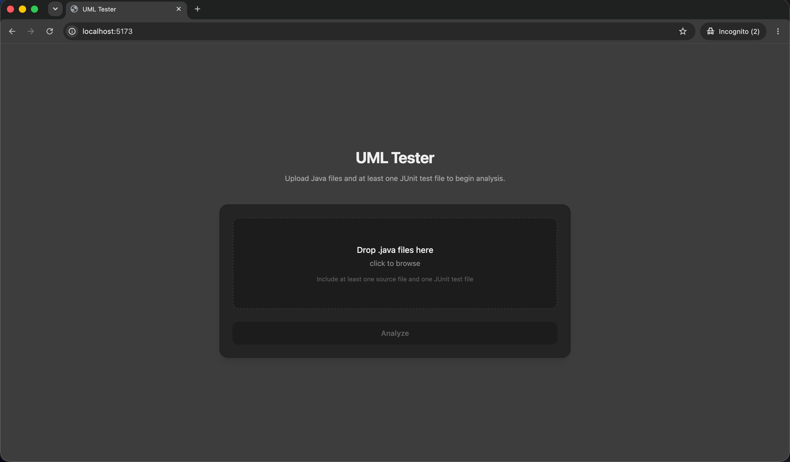
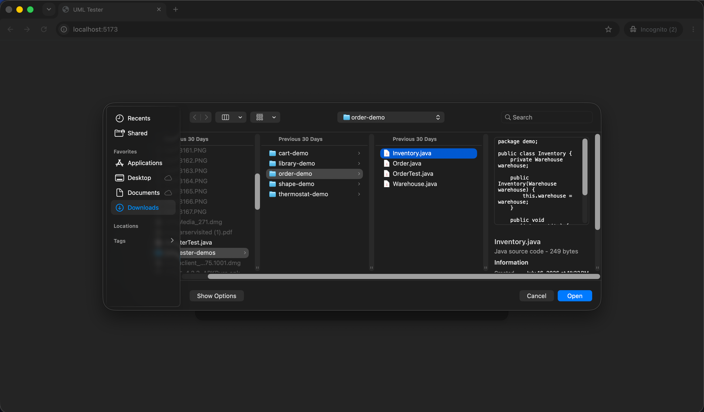
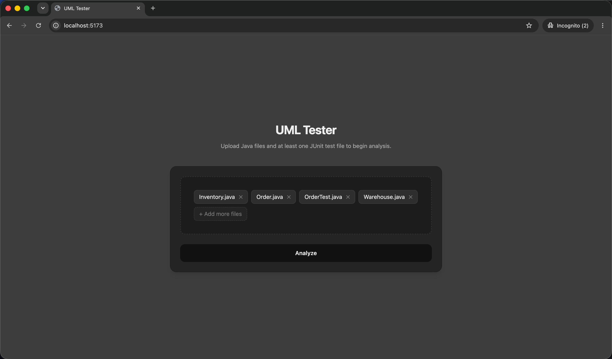
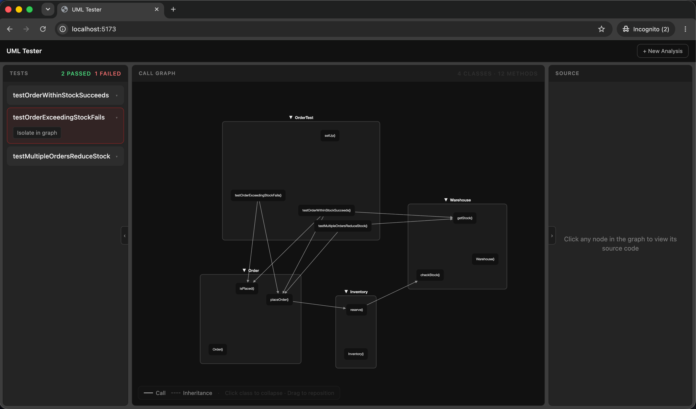
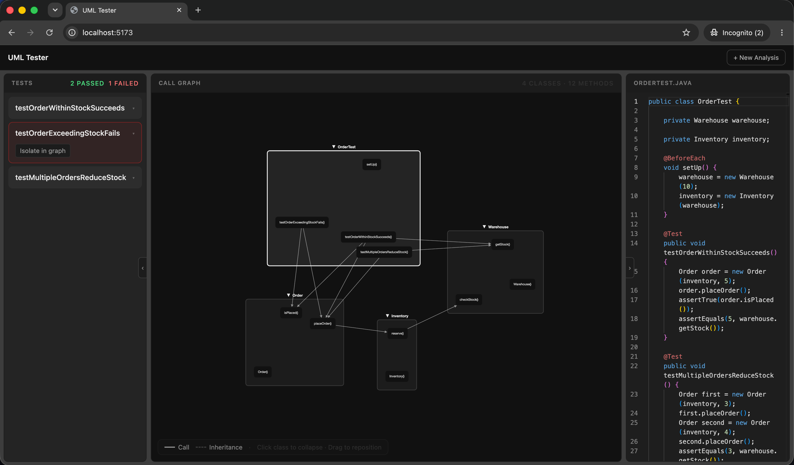
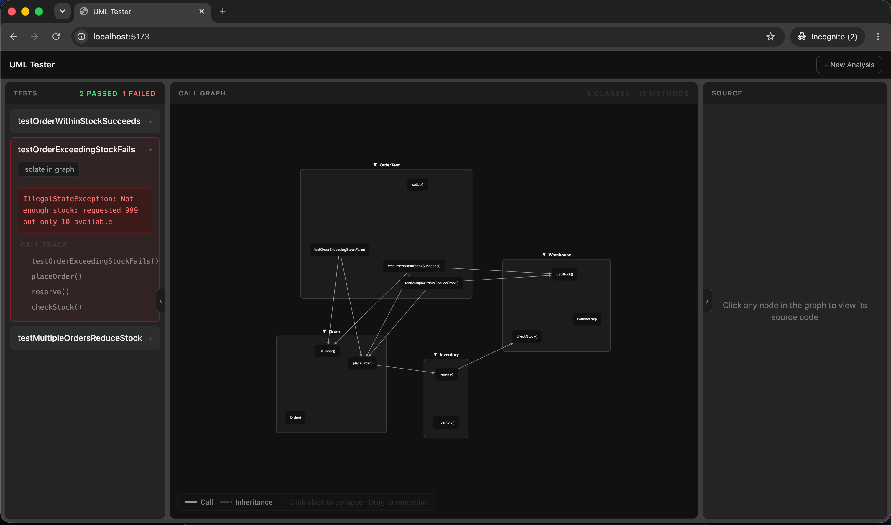
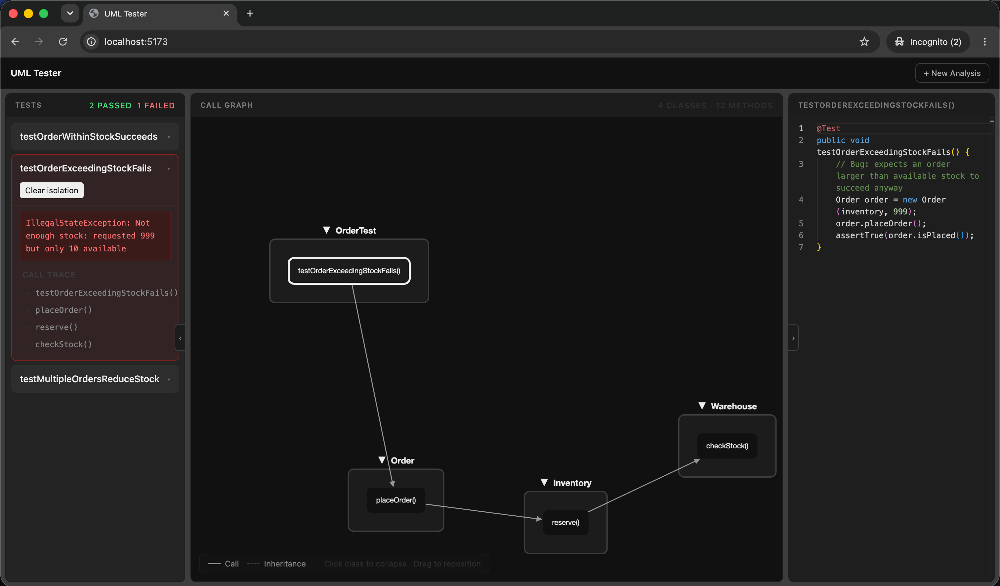

# uml-tester

**Introduction:**

uml-tester is a locally run program that takes a list of .java files and turns them into an interactive call graph, running any @Test methods found among the uploaded files (if any).

**How to use:**

- upload files
- examine the call graph and test case panel
- examine failed test cases by tracing its exact call path on the call graph


**What its meant for:**

when you're looking at unfamiliar (client's) java code, and want to understand its structure and correctness faster, or simply when you need to debug code

**NOTE: ONLY METHODS ANNOTATED WITH @Test (JUnit 5) ARE RECOGNIZED AND RUN.**


## Key features

1. **Interactive call graph:** renders classes as "nodes" in form of boxes containing their methods, with edges for method calls and inheritance between classes. 

2. **External call handling:** any codebase that isn't directly from any uploaded file gets registered under an "External" node 

3. **Class collapsing** collapse any class node/box to hide its methods and only show the connections at the class level. 

4. **In-memory JUnit execution:** all @Test are compiled, run and tested via JUnit Launcher, entirely from memory with no writes/reads from disk. 

5. **For each @Test:** get a pass, failed, or error status - failed and error tests also get an assertion message and a call trace.

6. **Failure trace isolation:** Show and isolate a failed test's call trace and view it in the call graph


## Demo


small demo for mac users. This shows, through pictures, how to use this program.


### 1. Upload page


The empty upload screen, before files are uploaded.


### 2. Add files


Upload the files you want to analyze and click open.


### 3. Starting analysis


Click on the `Analyze` to...analyze. And wait for the analysis to complete (only a few seconds)


### 4. Analysis overview


The Analysis screen has 3 panels. From left to right:
- test panel for passed/failed/error test cases (if any were uploaded)
- graph panel with the interactable rendered graph.
- source code panel which renders the source code when user clicks on any node


### 5. Source code panel


You can view any class/method's source code in the source code panel on the right, by clicking inside that node on the graph


### 6. Test cases


- For each passed test case, no call trace will be present.
- For each failed test case, a call trace will show when you click on that test case


### 7. Failed test case isolated in the graph


You can isolate a failed test case's call trace in the call graph to analyze and debug


## How it works

Two parts: backend and frontend.


Backend: does 2 jobs given an upload

1. **Parsing:** Build an AST for each uploaded file, then resolve method calls, and build a graph from all this.

2. **Test execution:** Compiles, and runs any detected @Test methods using the Junit platform launcher. For each test, it captures the result, and for failed tests, builds a call trace for it.

It wraps both items into one singular JSON response and returns it 

Frontend: 1 job

1. **renders graph:** renders the 3 panels with that response. 


## Install

### macOS

To simplify lives, will use homebrew.

If dont have homebrew, install it first via below:

```bash
/bin/bash -c "$(curl -fsSL https://raw.githubusercontent.com/Homebrew/install/HEAD/install.sh)"
```

THen we install everything we need to run this program

```bash
brew install openjdk maven node
```


### Windows

Similarly, for windows, we will use winget where we can. No need to install, comes with windows.

Check what you already have first:

```powershell
java -version   # should be java 21
mvn -version    # any version should be ok
node -version   # should be 18 or newer?
```

Install whatever's missing (or below the required version):

```powershell
winget install EclipseAdoptium.Temurin.21.JDK
winget install OpenJS.NodeJS
```

Maven doesn't have an winget package anymore, so we install manually:
1. Download the binary zip from [maven.apache.org/download.cgi](https://maven.apache.org/download.cgi)
2. Extract it somewhere.
3. Add its `bin` folder to your PATH environment variable


## Run it

start two terminals, one for backend server, and one for frontend. Make sure you are in the program folder first.

Start the backend:

```bash
cd backend
mvn compile exec:java
```

Start the frontend:

```bash
cd frontend
npm install
npm run dev
```

Open local host on port 5173 and upload at least .java file.


## Project structure

```
backend/src/main/java/umltester/
├── model/                      # classes/data structures that are used
├── parser/                     # JavaParser-based AST walk that builds the call graph
└── testrunner/                 # in-memory compile + JUnit execution of uploaded @Test methods

frontend/src/
├── components/
│   ├── UploadScreen/           # UI for file upload screen
│   └── AnalysisScreen/         # UI for analysis screen
│       ├── GraphPanel/         # UI Call graph using cytoscape
│       ├── SourcePanel/        # UI Source code viewer panel
│       └── TestResultsPanel/   # UI list tests with pass/fail and call trace for each failed test
├── store/                      # Zustand global state
├── types/                      # ts types matching the backend's model classes
└── api/                        # fetch wrapper for POST /api/analyze
```
